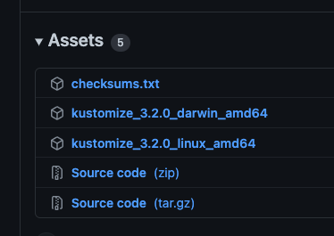

# Manual Install Kubeflow on DigitalOcean Kubernetes 


## Overview
---
> This repo is part of the [DigitalOcean Kubernetes Challenge](https://www.digitalocean.com/community/pages/kubernetes-challenge#anchor--success-criteria)

I have been wanting to play with Kubeflow for a while out of curiosity and for fun more than anything. A long time ago I tried it on Microk8s locally on a laptop and on a raspberrypi cluster and I couldn't make it function. If it worked locally it would also keep my available processors running increasing energy costs and taking up storage.  

Instead, I took advantage of DigitalOcean Kubernetes as is it's set up, cheaper than raspberrypi's, and  can be instantiated and used now. 

Like with any Kubernetes, once you pick a cluster it's easy to add or remove nodes to manage performance and costs. You can get started right away and don't need to manually configure and maintain your Kubernetes cluster. Workloads aren’t dependent on your internet connection and machine/lab setup if you need more power its easy to add with DigitalOcean Kubernetes

### Advantages to a manual Kubeflow installation

Kubeflow is a very fascinating project that originally started as a simple way to run Tensorflow on Kubernetes, but has since expanded. Now, Kubeflow has many common tools and frameworks used for Machine Learning to make it possible to run end-to-end ML workflows on Kubernetes. The Kubeflow project has a lot of the major machine learning and data science tools out there like Jupyter notebook, PyTorch, TensorFlow,. Using it is also fun because it's so customizable and easy to get a Jupyter notebook or terminal running.

* [Kubeflow's Architecture](https://www.kubeflow.org/docs/started/architecture/) 

Ultimately, the manual and packaged Kubeflow installations will deliver the same results, but there are some upsides to installing manually.

**Customizability:** Choose the Kubeflow components to include, maybe you want to just install KubeFlow Pipelines. Give your developers access only to what they need. Or install everything if you want to have it available. You can also customize your Kubeflow deployment alongside your Kubernetes cluster to have the exact amount of performance you need. Manual installations can potentially live anywhere with Kubernetes.

**Control:** A manual Kubeflow installation can be more robust than the "official" cloud versions in some ways. The UI can be different than cloud installations and you might prefer one over ther other. You can control the underlying Kubernetes and have it live in the same cluster alongside otherworkloads like running like a CI/CD tool to kick off workflows.


For my purposes I installed all the tools because I wanted to see what a full installation looked like. So I executed most of the install commands.

---

### Requirements

There is very little information on installing Kubeflow manually so I don't have info on cluster requirements. I would generally recommend at least 3 nodes with 4 GB RAM  and 2 vCPUs

* Kubernetes (recommend version 1.19) with a default StorageClass
    * Go to [DigitalOcean Kubernetes](https://cloud.digitalocean.com/kubernetes/clusters) in top right select `Create Cluster` to create a new cluster 
    * version recommended: `1.19.15-do.0`
    * Click create cluster and you will be taken to a **Getting Started** page, follow those instructions to set up your CLI etc while your cluster is created (takes 4 mins)
    * Since you are using DigitalOcean Kubernetes it will create a volume for you when needed so you don't have to worry about StorageClass
* [kustomize](https://github.com/kubernetes-sigs/kustomize/releases/tag/v3.2.0)(version 3.2.0)
    * Click the [link](https://github.com/kubernetes-sigs/kustomize/releases/tag/v3.2.0)(version 3.2.0) above to download the correct binary for your machine
    * Scroll to the bottom of the page and select the correct version for your machine like the following image 
        * Make the file executible with chmod +x and add it to your path
    * ⚠️ Kubeflow 1.4.0 is not compatible with the latest versions of of kustomize 4.x. The KubeFlow team is working on this with Kustomize.
* [kubectl](https://kubectl.docs.kubernetes.io/installation/kubectl/)

## Installation

> **Before installing:** Make sure to execute the install commands twice and verify everything was installed before proceeding to the next command. Some components have dependencies on others and might not install the first time you execute a command. This is normal for Kubernetes, especially when using Custom Resources (CRD's and CR's).

> [Kubeflow manifests](https://github.com/kubeflow/manifests#installation)

I attempted to put as much of the output as possible so that readers have more context. Don't forget to execute the commands a few times to make sure everything installs.

# Clone manifests repo

git clone https://github.com/kubeflow/manifests.git

# cd into /manifests
cd manifests 

#install cert manager
The Kubeflow cert-manager is used by many components to provide certificates for webhooks.

```bash
kustomize build common/cert-manager/cert-manager/base | kubectl apply -f -
kustomize build common/cert-manager/kubeflow-issuer/base | kubectl apply -f -
```

Your output should look like:
```bash
namespace/cert-manager created
customresourcedefinition.apiextensions.k8s.io/certificaterequests.cert-manager.io created
customresourcedefinition.apiextensions.k8s.io/certificates.cert-manager.io created
customresourcedefinition.apiextensions.k8s.io/challenges.acme.cert-manager.io created
customresourcedefinition.apiextensions.k8s.io/clusterissuers.cert-manager.io created
customresourcedefinition.apiextensions.k8s.io/issuers.cert-manager.io created
customresourcedefinition.apiextensions.k8s.io/orders.acme.cert-manager.io created
mutatingwebhookconfiguration.admissionregistration.k8s.io/cert-manager-webhook created
serviceaccount/cert-manager created
serviceaccount/cert-manager-cainjector created
serviceaccount/cert-manager-webhook created
role.rbac.authorization.k8s.io/cert-manager-webhook:dynamic-serving created
role.rbac.authorization.k8s.io/cert-manager-cainjector:leaderelection created
role.rbac.authorization.k8s.io/cert-manager:leaderelection created
clusterrole.rbac.authorization.k8s.io/cert-manager-cainjector created
clusterrole.rbac.authorization.k8s.io/cert-manager-controller-approve:cert-manager-io created
clusterrole.rbac.authorization.k8s.io/cert-manager-controller-certificates created
clusterrole.rbac.authorization.k8s.io/cert-manager-controller-challenges created
clusterrole.rbac.authorization.k8s.io/cert-manager-controller-clusterissuers created
clusterrole.rbac.authorization.k8s.io/cert-manager-controller-ingress-shim created
clusterrole.rbac.authorization.k8s.io/cert-manager-controller-issuers created
clusterrole.rbac.authorization.k8s.io/cert-manager-controller-orders created
clusterrole.rbac.authorization.k8s.io/cert-manager-edit created
clusterrole.rbac.authorization.k8s.io/cert-manager-view created
clusterrole.rbac.authorization.k8s.io/cert-manager-webhook:subjectaccessreviews created
rolebinding.rbac.authorization.k8s.io/cert-manager-webhook:dynamic-serving created
rolebinding.rbac.authorization.k8s.io/cert-manager-cainjector:leaderelection created
rolebinding.rbac.authorization.k8s.io/cert-manager:leaderelection created
clusterrolebinding.rbac.authorization.k8s.io/cert-manager-cainjector created
clusterrolebinding.rbac.authorization.k8s.io/cert-manager-controller-approve:cert-manager-io created
clusterrolebinding.rbac.authorization.k8s.io/cert-manager-controller-certificates created
clusterrolebinding.rbac.authorization.k8s.io/cert-manager-controller-challenges created
clusterrolebinding.rbac.authorization.k8s.io/cert-manager-controller-clusterissuers created
clusterrolebinding.rbac.authorization.k8s.io/cert-manager-controller-ingress-shim created
clusterrolebinding.rbac.authorization.k8s.io/cert-manager-controller-issuers created
clusterrolebinding.rbac.authorization.k8s.io/cert-manager-controller-orders created
clusterrolebinding.rbac.authorization.k8s.io/cert-manager-webhook:subjectaccessreviews created
service/cert-manager created
service/cert-manager-webhook created
deployment.apps/cert-manager created
deployment.apps/cert-manager-cainjector created
deployment.apps/cert-manager-webhook created
validatingwebhookconfiguration.admissionregistration.k8s.io/cert-manager-webhook created
clusterissuer.cert-manager.io/kubeflow-self-signing-issuer created
```


# install istio

Istio is used by many Kubeflow components to secure their traffic, enforce network authorization and implement routing policies.
```bash
kustomize build common/istio-1-9/istio-crds/base | kubectl apply -f -
kustomize build common/istio-1-9/istio-namespace/base | kubectl apply -f -
kustomize build common/istio-1-9/istio-install/base | kubectl apply -f -
```

Your outuput should be similar to:
```bash
customresourcedefinition.apiextensions.k8s.io/authorizationpolicies.security.istio.io created
customresourcedefinition.apiextensions.k8s.io/destinationrules.networking.istio.io created
customresourcedefinition.apiextensions.k8s.io/envoyfilters.networking.istio.io created
customresourcedefinition.apiextensions.k8s.io/gateways.networking.istio.io created
customresourcedefinition.apiextensions.k8s.io/istiooperators.install.istio.io created
customresourcedefinition.apiextensions.k8s.io/peerauthentications.security.istio.io created
customresourcedefinition.apiextensions.k8s.io/requestauthentications.security.istio.io created
customresourcedefinition.apiextensions.k8s.io/serviceentries.networking.istio.io created
customresourcedefinition.apiextensions.k8s.io/sidecars.networking.istio.io created
customresourcedefinition.apiextensions.k8s.io/virtualservices.networking.istio.io created
customresourcedefinition.apiextensions.k8s.io/workloadentries.networking.istio.io created
customresourcedefinition.apiextensions.k8s.io/workloadgroups.networking.istio.io created
namespace/istio-system created
Warning: admissionregistration.k8s.io/v1beta1 MutatingWebhookConfiguration is deprecated in v1.16+, unavailable in v1.22+; use admissionregistration.k8s.io/v1 MutatingWebhookConfiguration
mutatingwebhookconfiguration.admissionregistration.k8s.io/istio-sidecar-injector created
serviceaccount/istio-ingressgateway-service-account created
serviceaccount/istio-reader-service-account created
serviceaccount/istiod-service-account created
role.rbac.authorization.k8s.io/istio-ingressgateway-sds created
role.rbac.authorization.k8s.io/istiod-istio-system created
clusterrole.rbac.authorization.k8s.io/istio-reader-istio-system created
clusterrole.rbac.authorization.k8s.io/istiod-istio-system created
rolebinding.rbac.authorization.k8s.io/istio-ingressgateway-sds created
rolebinding.rbac.authorization.k8s.io/istiod-istio-system created
clusterrolebinding.rbac.authorization.k8s.io/istio-reader-istio-system created
clusterrolebinding.rbac.authorization.k8s.io/istiod-istio-system created
configmap/istio created
configmap/istio-sidecar-injector created
service/istio-ingressgateway created
service/istiod created
deployment.apps/istio-ingressgateway created
deployment.apps/istiod created
envoyfilter.networking.istio.io/metadata-exchange-1.8 created
envoyfilter.networking.istio.io/metadata-exchange-1.9 created
envoyfilter.networking.istio.io/stats-filter-1.8 created
envoyfilter.networking.istio.io/stats-filter-1.9 created
envoyfilter.networking.istio.io/tcp-metadata-exchange-1.8 created
envoyfilter.networking.istio.io/tcp-metadata-exchange-1.9 created
envoyfilter.networking.istio.io/tcp-stats-filter-1.8 created
envoyfilter.networking.istio.io/tcp-stats-filter-1.9 created
envoyfilter.networking.istio.io/x-forwarded-host created
gateway.networking.istio.io/istio-ingressgateway created
authorizationpolicy.security.istio.io/global-deny-all created
authorizationpolicy.security.istio.io/istio-ingressgateway created
Warning: admissionregistration.k8s.io/v1beta1 ValidatingWebhookConfiguration is deprecated in v1.16+, unavailable in v1.22+; use admissionregistration.k8s.io/v1 ValidatingWebhookConfiguration
validatingwebhookconfiguration.admissionregistration.k8s.io/istiod-istio-system created
```


# Installing Dex   
Dex is an OpenID Connect Identity (OIDC) with multiple authentication backends. In this default installation, it includes a static user with email user@example.com. 
By default, the user's password is 12341234. For any production Kubeflow deployment, you should change the default password by following the relevant section.

```bash
kustomize build common/dex/overlays/istio | kubectl apply -f - 
```

Your output will then be like:
```bash
namespace/auth created
Warning: apiextensions.k8s.io/v1beta1 CustomResourceDefinition is deprecated in v1.16+, unavailable in v1.22+; use apiextensions.k8s.io/v1 CustomResourceDefinition
customresourcedefinition.apiextensions.k8s.io/authcodes.dex.coreos.com created
serviceaccount/dex created
Warning: rbac.authorization.k8s.io/v1beta1 ClusterRole is deprecated in v1.17+, unavailable in v1.22+; use rbac.authorization.k8s.io/v1 ClusterRole
clusterrole.rbac.authorization.k8s.io/dex created
Warning: rbac.authorization.k8s.io/v1beta1 ClusterRoleBinding is deprecated in v1.17+, unavailable in v1.22+; use rbac.authorization.k8s.io/v1 ClusterRoleBinding
clusterrolebinding.rbac.authorization.k8s.io/dex created
configmap/dex created
secret/dex-oidc-client created
service/dex created
deployment.apps/dex created
virtualservice.networking.istio.io/dex created
```

# OIDC AuthService

The OIDC AuthService extends your Istio Ingress-Gateway capabilities, to be able to function as an OIDC client:
```bash
kustomize build common/oidc-authservice/base | kubectl apply -f -
```

Your output then being:
```bash
configmap/oidc-authservice-parameters created
secret/oidc-authservice-client created
service/authservice created
statefulset.apps/authservice created
envoyfilter.networking.istio.io/authn-filter created
persistentvolumeclaim/authservice-pvc created
```

# Install Knative serving

```bash
kustomize build common/knative/knative-serving/base | kubectl apply -f -
kustomize build common/istio-1-9/cluster-local-gateway/base | kubectl apply -f -
```

You should see similar output to:
```bash
namespace/knative-serving created
customresourcedefinition.apiextensions.k8s.io/certificates.networking.internal.knative.dev created
customresourcedefinition.apiextensions.k8s.io/configurations.serving.knative.dev created
customresourcedefinition.apiextensions.k8s.io/images.caching.internal.knative.dev created
customresourcedefinition.apiextensions.k8s.io/ingresses.networking.internal.knative.dev created
customresourcedefinition.apiextensions.k8s.io/metrics.autoscaling.internal.knative.dev created
customresourcedefinition.apiextensions.k8s.io/podautoscalers.autoscaling.internal.knative.dev created
customresourcedefinition.apiextensions.k8s.io/revisions.serving.knative.dev created
customresourcedefinition.apiextensions.k8s.io/routes.serving.knative.dev created
customresourcedefinition.apiextensions.k8s.io/serverlessservices.networking.internal.knative.dev created
customresourcedefinition.apiextensions.k8s.io/services.serving.knative.dev created
mutatingwebhookconfiguration.admissionregistration.k8s.io/webhook.istio.networking.internal.knative.dev created
mutatingwebhookconfiguration.admissionregistration.k8s.io/webhook.serving.knative.dev created
serviceaccount/controller created
clusterrole.rbac.authorization.k8s.io/knative-serving-addressable-resolver created
clusterrole.rbac.authorization.k8s.io/knative-serving-admin created
clusterrole.rbac.authorization.k8s.io/knative-serving-core created
clusterrole.rbac.authorization.k8s.io/knative-serving-istio created
clusterrole.rbac.authorization.k8s.io/knative-serving-namespaced-admin created
clusterrole.rbac.authorization.k8s.io/knative-serving-namespaced-edit created
clusterrole.rbac.authorization.k8s.io/knative-serving-namespaced-view created
clusterrole.rbac.authorization.k8s.io/knative-serving-podspecable-binding created
clusterrolebinding.rbac.authorization.k8s.io/knative-serving-controller-admin created
configmap/config-autoscaler created
configmap/config-defaults created
configmap/config-deployment created
configmap/config-domain created
configmap/config-features created
configmap/config-gc created
configmap/config-istio created
configmap/config-leader-election created
...
```

Optionally, you can install Knative Eventing which can be used for inference request logging:

```
kustomize build common/knative/knative-eventing/base | kubectl apply -f -
```

### Install kubeflow namespace:
Create the namespace where the Kubeflow components will live in. This namespace is named kubeflow.

The following command creates the namesapces for Kubeflow components
```bash
kustomize build common/kubeflow-namespace/base | kubectl apply -f -
```

Your output will look like:
```bash
namespace/kubeflow created
```

### Install kubeflow roles:
Create the Kubeflow ClusterRoles, kubeflow-view, kubeflow-edit and kubeflow-admin:
```
kustomize build common/kubeflow-roles/base | kubectl apply -f -
```

Your output will then be like:
```bash
clusterrole.rbac.authorization.k8s.io/kubeflow-admin created
clusterrole.rbac.authorization.k8s.io/kubeflow-edit created
clusterrole.rbac.authorization.k8s.io/kubeflow-kubernetes-admin created
clusterrole.rbac.authorization.k8s.io/kubeflow-kubernetes-edit created
clusterrole.rbac.authorization.k8s.io/kubeflow-kubernetes-view created
clusterrole.rbac.authorization.k8s.io/kubeflow-view created
```

### Kubeflow Istio Resources
Create the Istio resources needed by Kubeflow. This kustomization currently creates an Istio Gateway named `kubeflow-gateway`, in namespace kubeflow. If you want to install with your own Istio, then you need this kustomization as well.

Install istio resources:
```bash
kustomize build common/istio-1-9/kubeflow-istio-resources/base | kubectl apply -f -
```

The output will look like
```bash
clusterrole.rbac.authorization.k8s.io/kubeflow-istio-admin created
clusterrole.rbac.authorization.k8s.io/kubeflow-istio-edit created
clusterrole.rbac.authorization.k8s.io/kubeflow-istio-view created
gateway.networking.istio.io/kubeflow-gateway created
```

### Kubeflow Pipelines
Install the Multi-User Kubeflow Pipelines official Kubeflow component:

Remember to fully execute the commands at least twice to make sure everything installs:
```
kustomize build apps/pipeline/upstream/env/platform-agnostic-multi-user | kubectl apply -f -
```

Your output will show the pipelines that were created, a lot of the output is ommitted as it's too long
```
customresourcedefinition.apiextensions.k8s.io/cronworkflows.argoproj.io created
customresourcedefinition.apiextensions.k8s.io/workfloweventbindings.argoproj.io created
customresourcedefinition.apiextensions.k8s.io/workflows.argoproj.io created
customresourcedefinition.apiextensions.k8s.io/workflowtemplates.argoproj.io created
Warning: apiextensions.k8s.io/v1beta1 CustomResourceDefinition is deprecated in v1.16+, unavailable in v1.22+; use apiextensions.k8s.io/v1 CustomResourceDefinition
customresourcedefinition.apiextensions.k8s.io/compositecontrollers.metacontroller.k8s.io created
customresourcedefinition.apiextensions.k8s.io/controllerrevisions.metacontroller.k8s.io created
customresourcedefinition.apiextensions.k8s.io/decoratorcontrollers.metacontroller.k8s.io created
customresourcedefinition.apiextensions.k8s.io/scheduledworkflows.kubeflow.org created
customresourcedefinition.apiextensions.k8s.io/viewers.kubeflow.org created
serviceaccount/argo created
serviceaccount/kubeflow-pipelines-cache created
serviceaccount/kubeflow-pipelines-cache-deployer-sa created
serviceaccount/kubeflow-pipelines-container-builder created
serviceaccount/kubeflow-pipelines-metadata-writer created
serviceaccount/kubeflow-pipelines-viewer created
serviceaccount/meta-controller-service created
serviceaccount/metadata-grpc-server created
serviceaccount/ml-pipeline created
serviceaccount/ml-pipeline-persistenceagent created
serviceaccount/ml-pipeline-scheduledworkflow created
serviceaccount/ml-pipeline-ui created
serviceaccount/ml-pipeline-viewer-crd-service-account created
...
```

### KFServing
Install the KFServing official Kubeflow component:

```bash
kustomize build apps/kfserving/upstream/overlays/kubeflow | kubectl apply -f -
```

The output after the command looks like:
```bash
Warning: apiextensions.k8s.io/v1beta1 CustomResourceDefinition is deprecated in v1.16+, unavailable in v1.22+; use apiextensions.k8s.io/v1 CustomResourceDefinition
customresourcedefinition.apiextensions.k8s.io/inferenceservices.serving.kubeflow.org created
customresourcedefinition.apiextensions.k8s.io/trainedmodels.serving.kubeflow.org created
Warning: admissionregistration.k8s.io/v1beta1 MutatingWebhookConfiguration is deprecated in v1.16+, unavailable in v1.22+; use admissionregistration.k8s.io/v1 MutatingWebhookConfiguration
mutatingwebhookconfiguration.admissionregistration.k8s.io/inferenceservice.serving.kubeflow.org created
serviceaccount/kfserving-models-web-app created
role.rbac.authorization.k8s.io/leader-election-role created
clusterrole.rbac.authorization.k8s.io/kfserving-manager-role created
clusterrole.rbac.authorization.k8s.io/kfserving-models-web-app-cluster-role created
ivantarin@C02G791VMD6M manifests % kustomize build apps/kfserving/upstream/overlays/kubeflow | kubectl apply -f -
Warning: apiextensions.k8s.io/v1beta1 CustomResourceDefinition is deprecated in v1.16+, unavailable in v1.22+; use apiextensions.k8s.io/v1 CustomResourceDefinition
customresourcedefinition.apiextensions.k8s.io/inferenceservices.serving.kubeflow.org configured
customresourcedefinition.apiextensions.k8s.io/trainedmodels.serving.kubeflow.org configured
Warning: admissionregistration.k8s.io/v1beta1 MutatingWebhookConfiguration is deprecated in v1.16+, unavailable in v1.22+; use admissionregistration.k8s.io/v1 MutatingWebhookConfiguration
mutatingwebhookconfiguration.admissionregistration.k8s.io/inferenceservice.serving.kubeflow.org configured
...
```

###  Katib
Install the Katib official Kubeflow component:

```bash
kustomize build apps/katib/upstream/installs/katib-with-kubeflow | kubectl apply -f -
```
Your output will be like:
```bash
customresourcedefinition.apiextensions.k8s.io/experiments.kubeflow.org created
customresourcedefinition.apiextensions.k8s.io/suggestions.kubeflow.org created
customresourcedefinition.apiextensions.k8s.io/trials.kubeflow.org created
mutatingwebhookconfiguration.admissionregistration.k8s.io/katib.kubeflow.org created
serviceaccount/katib-controller created
serviceaccount/katib-ui created
clusterrole.rbac.authorization.k8s.io/katib-controller created
clusterrole.rbac.authorization.k8s.io/katib-ui created
clusterrole.rbac.authorization.k8s.io/kubeflow-katib-admin created
clusterrole.rbac.authorization.k8s.io/kubeflow-katib-edit created
clusterrole.rbac.authorization.k8s.io/kubeflow-katib-view created
clusterrolebinding.rbac.authorization.k8s.io/katib-controller created
clusterrolebinding.rbac.authorization.k8s.io/katib-ui created
configmap/katib-config created
configmap/trial-templates created
secret/katib-mysql-secrets created
service/katib-controller created
service/katib-db-manager created
service/katib-mysql created
service/katib-ui created
deployment.apps/katib-controller created
deployment.apps/katib-db-manager created
deployment.apps/katib-mysql created
deployment.apps/katib-ui created
certificate.cert-manager.io/katib-webhook-cert created
issuer.cert-manager.io/katib-selfsigned-issuer created
virtualservice.networking.istio.io/katib-ui created
persistentvolumeclaim/katib-mysql created
validatingwebhookconfiguration.admissionregistration.k8s.io/katib.kubeflow.org created
```


### Central Dashboard

Install the Central Dashboard official Kubeflow component:

```bash
kustomize build apps/centraldashboard/upstream/overlays/istio | kubectl apply -f -
```

That installation had the next output:
```bash
serviceaccount/centraldashboard created
role.rbac.authorization.k8s.io/centraldashboard created
clusterrole.rbac.authorization.k8s.io/centraldashboard created
rolebinding.rbac.authorization.k8s.io/centraldashboard created
clusterrolebinding.rbac.authorization.k8s.io/centraldashboard created
configmap/centraldashboard-config created
configmap/centraldashboard-parameters created
service/centraldashboard created
deployment.apps/centraldashboard created
virtualservice.networking.istio.io/centraldashboard created
```

###  Admission Webhook
Install the Admission Webhook for PodDefaults:

```bash
kustomize build apps/admission-webhook/upstream/overlays/cert-manager | kubectl apply -f -
```

The following is the output:
```bash
Warning: apiextensions.k8s.io/v1beta1 CustomResourceDefinition is deprecated in v1.16+, unavailable in v1.22+; use apiextensions.k8s.io/v1 CustomResourceDefinition
customresourcedefinition.apiextensions.k8s.io/poddefaults.kubeflow.org created
Warning: admissionregistration.k8s.io/v1beta1 MutatingWebhookConfiguration is deprecated in v1.16+, unavailable in v1.22+; use admissionregistration.k8s.io/v1 MutatingWebhookConfiguration
mutatingwebhookconfiguration.admissionregistration.k8s.io/admission-webhook-mutating-webhook-configuration created
serviceaccount/admission-webhook-service-account created
clusterrole.rbac.authorization.k8s.io/admission-webhook-cluster-role created
clusterrole.rbac.authorization.k8s.io/admission-webhook-kubeflow-poddefaults-admin created
clusterrole.rbac.authorization.k8s.io/admission-webhook-kubeflow-poddefaults-edit created
clusterrole.rbac.authorization.k8s.io/admission-webhook-kubeflow-poddefaults-view created
clusterrolebinding.rbac.authorization.k8s.io/admission-webhook-cluster-role-binding created
service/admission-webhook-service created
deployment.apps/admission-webhook-deployment created
certificate.cert-manager.io/admission-webhook-cert created
```

### Notebooks

Install the Notebook Controller official Kubeflow component:
```bash
kustomize build apps/jupyter/notebook-controller/upstream/overlays/kubeflow | kubectl apply -f -
```

This provides the following output:
```bash
Warning: apiextensions.k8s.io/v1beta1 CustomResourceDefinition is deprecated in v1.16+, unavailable in v1.22+; use apiextensions.k8s.io/v1 CustomResourceDefinition
customresourcedefinition.apiextensions.k8s.io/notebooks.kubeflow.org created
serviceaccount/notebook-controller-service-account created
role.rbac.authorization.k8s.io/notebook-controller-leader-election-role created
clusterrole.rbac.authorization.k8s.io/notebook-controller-kubeflow-notebooks-admin created
clusterrole.rbac.authorization.k8s.io/notebook-controller-kubeflow-notebooks-edit created
clusterrole.rbac.authorization.k8s.io/notebook-controller-kubeflow-notebooks-view created
clusterrole.rbac.authorization.k8s.io/notebook-controller-role created
rolebinding.rbac.authorization.k8s.io/notebook-controller-leader-election-rolebinding created
clusterrolebinding.rbac.authorization.k8s.io/notebook-controller-role-binding created
configmap/notebook-controller-config-kkt88f2bhb created
service/notebook-controller-service created
deployment.apps/notebook-controller-deployment created
```

###  Install the Jupyter Web App official Kubeflow component:
Now, install the Jupyter Web App:
```bash
kustomize build apps/jupyter/jupyter-web-app/upstream/overlays/istio | kubectl apply -f -
```

Then your output will reflect:
```bash
serviceaccount/jupyter-web-app-service-account created
Warning: rbac.authorization.k8s.io/v1beta1 Role is deprecated in v1.17+, unavailable in v1.22+; use rbac.authorization.k8s.io/v1 Role
role.rbac.authorization.k8s.io/jupyter-web-app-jupyter-notebook-role created
clusterrole.rbac.authorization.k8s.io/jupyter-web-app-cluster-role created
clusterrole.rbac.authorization.k8s.io/jupyter-web-app-kubeflow-notebook-ui-admin created
clusterrole.rbac.authorization.k8s.io/jupyter-web-app-kubeflow-notebook-ui-edit created
clusterrole.rbac.authorization.k8s.io/jupyter-web-app-kubeflow-notebook-ui-view created
Warning: rbac.authorization.k8s.io/v1beta1 RoleBinding is deprecated in v1.17+, unavailable in v1.22+; use rbac.authorization.k8s.io/v1 RoleBinding
rolebinding.rbac.authorization.k8s.io/jupyter-web-app-jupyter-notebook-role-binding created
clusterrolebinding.rbac.authorization.k8s.io/jupyter-web-app-cluster-role-binding created
configmap/jupyter-web-app-config-c6mgtkmgh4 created
configmap/jupyter-web-app-logos created
configmap/jupyter-web-app-parameters-h7dbhff8cb created
service/jupyter-web-app-service created
deployment.apps/jupyter-web-app-deployment created
virtualservice.networking.istio.io/jupyter-web-app-jupyter-web-app created
```


### Profiles + KFAM
Install the Profile Controller and the Kubeflow Access-Management (KFAM) :
```bash
kustomize build apps/profiles/upstream/overlays/kubeflow | kubectl apply -f -
```

The terminal will look like:
```bash
Warning: apiextensions.k8s.io/v1beta1 CustomResourceDefinition is deprecated in v1.16+, unavailable in v1.22+; use apiextensions.k8s.io/v1 CustomResourceDefinition
customresourcedefinition.apiextensions.k8s.io/notebooks.kubeflow.org configured
serviceaccount/notebook-controller-service-account unchanged
role.rbac.authorization.k8s.io/notebook-controller-leader-election-role unchanged
clusterrole.rbac.authorization.k8s.io/notebook-controller-kubeflow-notebooks-admin configured
ivantarin@C02G791VMD6M manifests % kustomize build apps/profiles/upstream/overlays/kubeflow | kubectl apply -f -
customresourcedefinition.apiextensions.k8s.io/profiles.kubeflow.org created
serviceaccount/profiles-controller-service-account created
role.rbac.authorization.k8s.io/profiles-leader-election-role created
rolebinding.rbac.authorization.k8s.io/profiles-leader-election-rolebinding created
clusterrolebinding.rbac.authorization.k8s.io/profiles-cluster-role-binding created
configmap/namespace-labels-data-m76mmk6ckt created
configmap/profiles-config-2g29dd2mbd created
service/profiles-kfam created
deployment.apps/profiles-deployment created
virtualservice.networking.istio.io/profiles-kfam created
```

### Volumes Web App
Install the Volumes Web App official Kubeflow component:
```bash
kustomize build apps/volumes-web-app/upstream/overlays/istio | kubectl apply -f -
```

Then you will see output like:
```bash
serviceaccount/volumes-web-app-service-account created
clusterrole.rbac.authorization.k8s.io/volumes-web-app-cluster-role created
clusterrole.rbac.authorization.k8s.io/volumes-web-app-kubeflow-volume-ui-admin created
clusterrole.rbac.authorization.k8s.io/volumes-web-app-kubeflow-volume-ui-edit created
clusterrole.rbac.authorization.k8s.io/volumes-web-app-kubeflow-volume-ui-view created
clusterrolebinding.rbac.authorization.k8s.io/volumes-web-app-cluster-role-binding created
configmap/volumes-web-app-parameters-d9b9bmk7ch created
service/volumes-web-app-service created
deployment.apps/volumes-web-app-deployment created
virtualservice.networking.istio.io/volumes-web-app-volumes-web-app created
```


### Tensorboard
Install the Tensorboards Web App official Kubeflow component:
```bas
kustomize build apps/tensorboard/tensorboards-web-app/upstream/overlays/istio | kubectl apply -f -
```

You then will have the output:
```bash
serviceaccount/volumes-web-app-service-account created
clusterrole.rbac.authorization.k8s.io/volumes-web-app-cluster-role created
clusterrole.rbac.authorization.k8s.io/volumes-web-app-kubeflow-volume-ui-admin created
clusterrole.rbac.authorization.k8s.io/volumes-web-app-kubeflow-volume-ui-edit created
clusterrole.rbac.authorization.k8s.io/volumes-web-app-kubeflow-volume-ui-view created
clusterrolebinding.rbac.authorization.k8s.io/volumes-web-app-cluster-role-binding created
configmap/volumes-web-app-parameters-d9b9bmk7ch created
service/volumes-web-app-service created
deployment.apps/volumes-web-app-deployment created
virtualservice.networking.istio.io/volumes-web-app-volumes-web-app created
```


### Install Tensorboard
Install the Tensorboard Controller official Kubeflow component:
```bash
kustomize build apps/tensorboard/tensorboard-controller/upstream/overlays/kubeflow | kubectl apply -f -
```

Your output will now look like:
```bash
serviceaccount/tensorboards-web-app-service-account created
clusterrole.rbac.authorization.k8s.io/tensorboards-web-app-cluster-role created
clusterrole.rbac.authorization.k8s.io/tensorboards-web-app-kubeflow-tensorboard-ui-admin created
clusterrole.rbac.authorization.k8s.io/tensorboards-web-app-kubeflow-tensorboard-ui-edit created
clusterrole.rbac.authorization.k8s.io/tensorboards-web-app-kubeflow-tensorboard-ui-view created
clusterrolebinding.rbac.authorization.k8s.io/tensorboards-web-app-cluster-role-binding created
configmap/tensorboards-web-app-parameters-bdb48k45kd created
service/tensorboards-web-app-service created
deployment.apps/tensorboards-web-app-deployment created
Error from server (InternalError): error when creating "STDIN": Internal error occurred: failed calling webhook "validation.istio.io": Post "https://istiod.istio-system.svc:443/validate?timeout=30s": context deadline exceeded (Client.Timeout exceeded while awaiting headers)
```

### Training Operator

Install the Training Operator official:
```bash
kustomize build apps/training-operator/upstream/overlays/kubeflow | kubectl apply -f -
```

The output is:
```bash
customresourcedefinition.apiextensions.k8s.io/mxjobs.kubeflow.org created
customresourcedefinition.apiextensions.k8s.io/pytorchjobs.kubeflow.org created
customresourcedefinition.apiextensions.k8s.io/tfjobs.kubeflow.org created
customresourcedefinition.apiextensions.k8s.io/xgboostjobs.kubeflow.org created
serviceaccount/training-operator created
clusterrole.rbac.authorization.k8s.io/kubeflow-training-admin created
clusterrole.rbac.authorization.k8s.io/kubeflow-training-edit created
clusterrole.rbac.authorization.k8s.io/kubeflow-training-view created
clusterrole.rbac.authorization.k8s.io/training-operator created
clusterrolebinding.rbac.authorization.k8s.io/training-operator created
service/training-operator created
deployment.apps/training-operator created
```

### MPI Operator
Install the MPI Operator official Kubeflow component:

```bash
kustomize build apps/mpi-job/upstream/overlays/kubeflow | kubectl apply -f -
```

Next, your output will be:
```bash
Warning: apiextensions.k8s.io/v1beta1 CustomResourceDefinition is deprecated in v1.16+, unavailable in v1.22+; use apiextensions.k8s.io/v1 CustomResourceDefinition
customresourcedefinition.apiextensions.k8s.io/mpijobs.kubeflow.org created
serviceaccount/mpi-operator created
clusterrole.rbac.authorization.k8s.io/kubeflow-mpijobs-admin created
clusterrole.rbac.authorization.k8s.io/kubeflow-mpijobs-edit created
clusterrole.rbac.authorization.k8s.io/kubeflow-mpijobs-view created
clusterrole.rbac.authorization.k8s.io/mpi-operator created
clusterrolebinding.rbac.authorization.k8s.io/mpi-operator created
configmap/mpi-operator-config created
deployment.apps/mpi-operator created
```

### User Namespace
Finally, create a new namespace for the the default user (named kubeflow-user-example-com)

```
kustomize build common/user-namespace/base | kubectl apply -f -
```

Your last output message:
```
Warning: apiextensions.k8s.io/v1beta1 CustomResourceDefinition is deprecated in v1.16+, unavailable in v1.22+; use apiextensions.k8s.io/v1 CustomResourceDefinition
customresourcedefinition.apiextensions.k8s.io/mpijobs.kubeflow.org unchanged
serviceaccount/mpi-operator unchanged
clusterrole.rbac.authorization.k8s.io/kubeflow-mpijobs-admin configured
clusterrole.rbac.authorization.k8s.io/kubeflow-mpijobs-edit unchanged
clusterrole.rbac.authorization.k8s.io/kubeflow-mpijobs-view unchanged
clusterrole.rbac.authorization.k8s.io/mpi-operator unchanged
clusterrolebinding.rbac.authorization.k8s.io/mpi-operator unchanged
configmap/mpi-operator-config unchanged
deployment.apps/mpi-operator unchanged
ivantarin@C02G791VMD6M manifests % kustomize build common/user-namespace/base | kubectl apply -f -
configmap/default-install-config-5cbhhbttg4 created
profile.kubeflow.org/kubeflow-user-example-com created
```

## Connect to Kubeflow 
After installing wait some time for all the pods to be READY. Otherwise you might get unexpected errors. 

To verify the pods are ready, use the following :
```
kubectl get pods -n cert-manager
kubectl get pods -n istio-system
kubectl get pods -n auth
kubectl get pods -n knative-eventing
kubectl get pods -n knative-serving
kubectl get pods -n kubeflow
kubectl get pods -n kubeflow-user-example-com
```

### Port forward
Run the following to port-forward Istio's Ingress-Gateway to local port 8080:
```
kubectl port-forward svc/istio-ingressgateway -n istio-system 8080:80
```


Login with the default user: 
```
user@example.com 
```

The default password is 
```
12341234
```

* [For info on setting up NodePort / LoadBalancer / Ingress](https://github.com/kubeflow/manifests#nodeport--loadbalancer--ingress)
* [To Change the default password](https://github.com/kubeflow/manifests#change-default-user-password)
